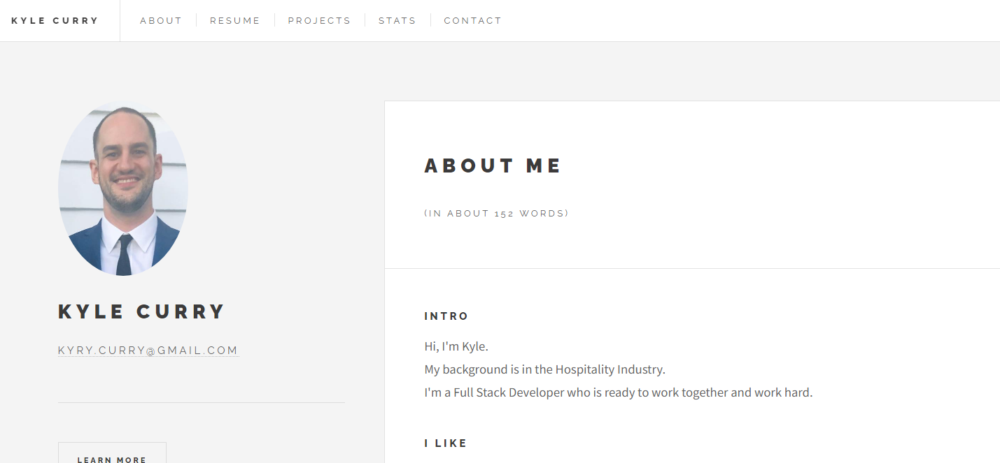

# C20-React-Portfolio-KC

## Description

This is my portfolio built with React. It contains a brief bio, my projects, and my contact information. 

## Table of Contents

- [Screenshot](#Screenshot)
- [Deployed Application](#Deployed-Application)
- [Installation](#Installation)
- [License](#License)
- [Questions](#Questions)

## Screenshot

## Deployed Application
https://hotbarbeque.github.io/C20-React-Portfolio-KC/

## Installation
 To get this app to work: 
 Clone this repo. 
 Then open the integrated terminal and enter `npm i && npm start` 

## License

MIT

## Questions

GitHub: [Kyle Curry](https://github.com/hotbarbeque/)

Email: kyry.curry@gmail.com